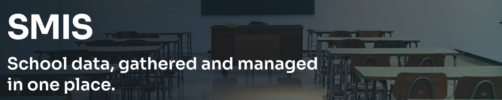

# SMIS — Smart School Data Gathering & Management System



Laravel web application for day-to-day school operations: academic structure, teachers and students, attendance, timetables, examinations, reporting, and an admin activity log.

There is **no public registration**. Admins create accounts. A REST API layer was intentionally skipped for the current web-only release.

## Stack

| Layer | Choice |
|---|---|
| Backend | Laravel 13, PHP 8.4 |
| Auth | Laravel Fortify (password + optional 2FA) |
| Authorization | Spatie `laravel-permission` + Laravel Policies |
| UI | Livewire 4, Flux UI, Tailwind CSS 4, Chart.js |
| Database | SQLite (local/tests) or MySQL (production) |
| Tests | Pest 5 |

## Features

- **Admin** — officers, academic years/grades/streams/subjects/classes, teachers & assignments, students, timetables & relief, attendance, exams & marks, reports, activity log; every index has filters and pagination
- **Officer** — school office data entry (same operational modules as admin) + activity log; cannot manage officers
- **Teacher** — scoped students, timetable, attendance, marks, class analytics
- **Student** — own timetable, attendance, published results, personal report
- **Dashboards** — role-specific KPIs and Chart.js charts
- **Audit** — activity log for sensitive actions (users, marks, publish, attendance)

## Quick start

```bash
composer setup
# or:
cp .env.example .env
php artisan key:generate
php artisan migrate --seed
npm install && npm run build
php artisan serve
```

App: [http://localhost:8000](http://localhost:8000)

For Vite + server together:

```bash
composer run dev
```

After pulling schema/permission changes:

```bash
php artisan migrate
php artisan db:seed --class=RolesAndPermissionsSeeder
```

## Demo accounts

Seeded by `php artisan migrate:fresh --seed` (password for all: `password`). Dataset is a Type 1AB-style school: **1 admin, 5 officers, 30 teachers, 600 students** (ADR 0015).

| Role | Email | Notes |
|---|---|---|
| Admin | `admin@smis.test` | Udana Vidushanka |
| Officer | `officer@smis.test` | Tharushi Fernando (4 more officers seeded) |
| Class teacher | `class.teacher@smis.test` | Nimal Perera, homeroom `10-A` |
| Subject teacher | `subject.teacher@smis.test` | Chaminda Jayasinghe, O/L Mathematics |
| Student | `student@smis.test` | Kasun Perera, class `10-A` |

## Documentation

All project docs live under [`docs/`](docs/):

| Doc | Purpose |
|---|---|
| [`docs/PROJECT_STATUS.md`](docs/PROJECT_STATUS.md) | Living status, changelog, open decisions |
| [`docs/setup/local-development.md`](docs/setup/local-development.md) | Env vars, seeding, packages |
| [`docs/architecture/`](docs/architecture/) | Overview, ER diagram, folder structure |
| [`docs/modules/`](docs/modules/) | Per-module purpose, routes, rules |
| [`docs/api/`](docs/api/) | Web route inventories (API skipped — ADR 0009) |
| [`docs/decisions/`](docs/decisions/) | Architecture Decision Records |
| [`docs/testing/`](docs/testing/) | Strategy and coverage log |
| [`CHANGELOG.md`](CHANGELOG.md) | Phase-level release notes |

## Tests

```bash
php artisan test --compact
```

Optional CI-style check:

```bash
composer ci:check
```

## License

MIT
