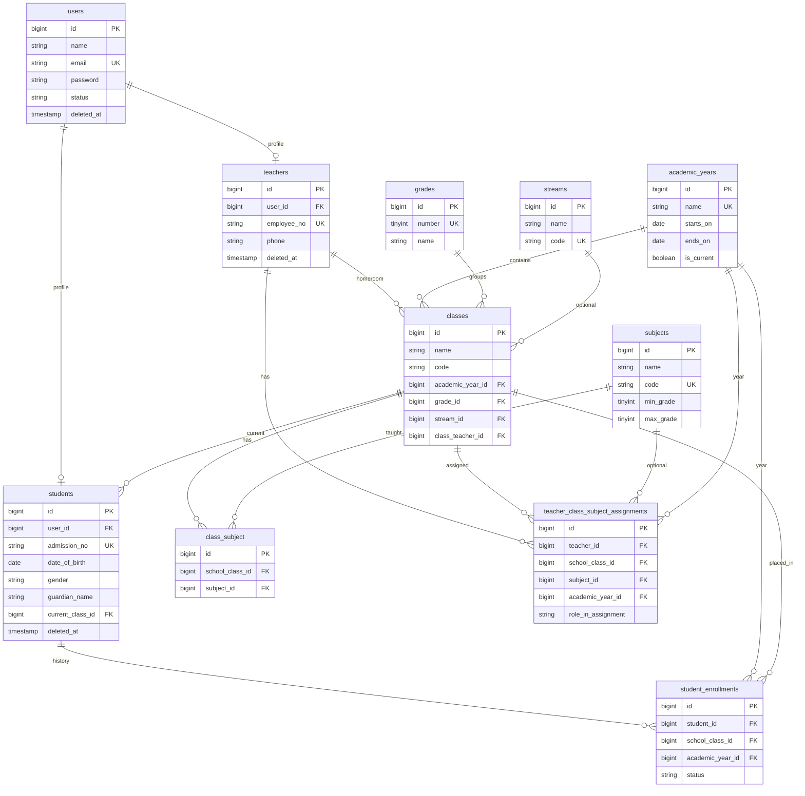

# ER Diagram

> Updated through Phase 3 (teachers, students, assignments, enrollments).

## Current schema

## Planned entities (Phases 4–7)

timetables, relief_teacher_assignments, attendance_sessions, student_attendance, teacher_attendance, exams, exam_subjects, marks, activity_log, admins profile.
