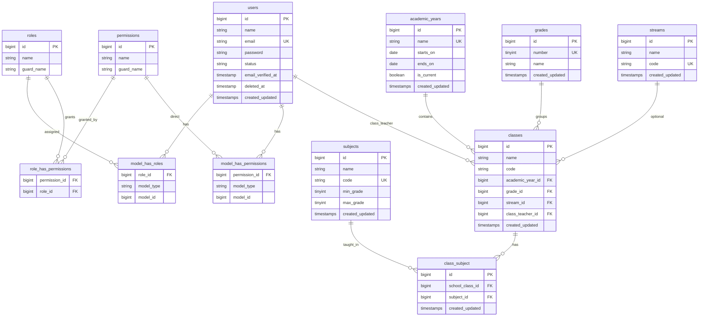

# ER Diagram

> Updated through Phase 2 (academic structure). Teacher/student profiles arrive in Phase 3.

## Current schema

## Planned entities (Phases 3–7)

admins, teachers, students, teacher_class_subject_assignments, student_enrollments, timetables, relief_teacher_assignments, attendance_sessions, student_attendance, teacher_attendance, exams, exam_subjects, marks, activity_log.
