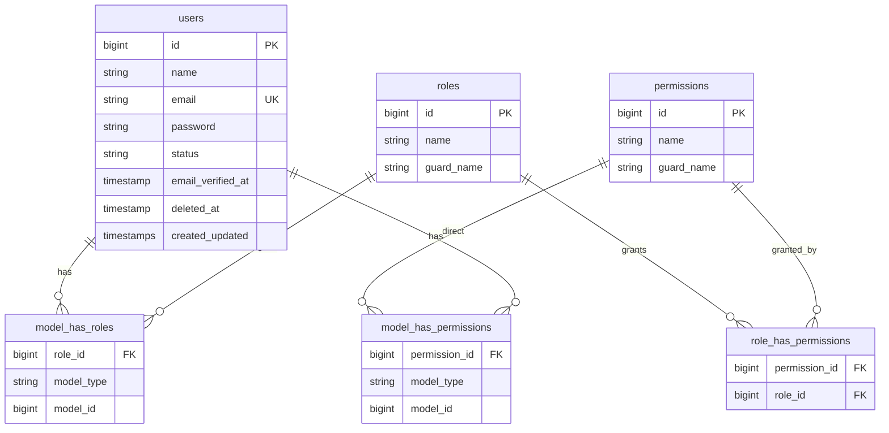

# ER Diagram

> Updated through Phase 1. Domain tables for academic structure and later modules will extend this diagram.

## Current schema

## Planned entities (Phases 2–7)

admins, teachers, students, academic_years, grades, streams, classes, subjects, class_subject, teacher_class_subject_assignments, student_enrollments, timetables, relief_teacher_assignments, attendance_sessions, student_attendance, teacher_attendance, exams, exam_subjects, marks, activity_log.
