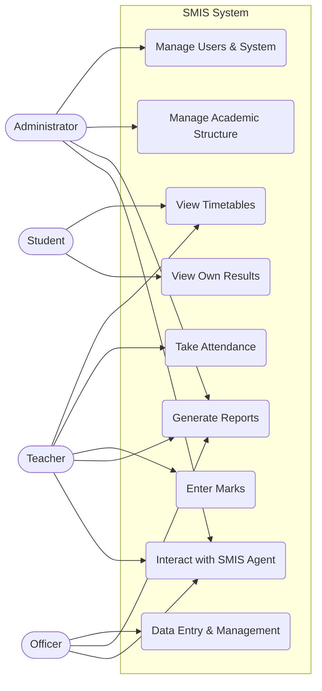
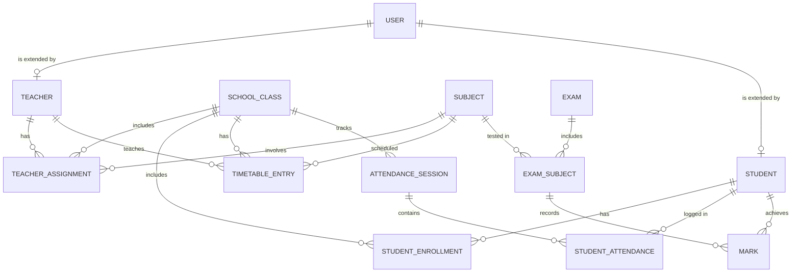
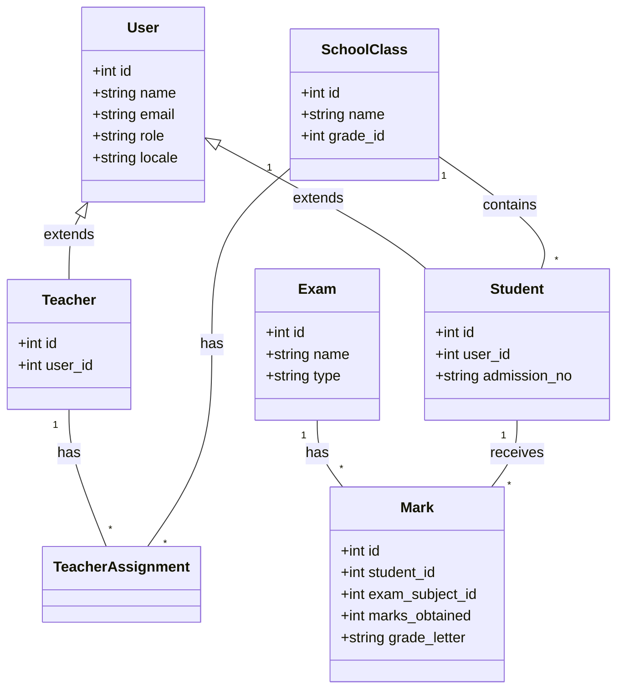
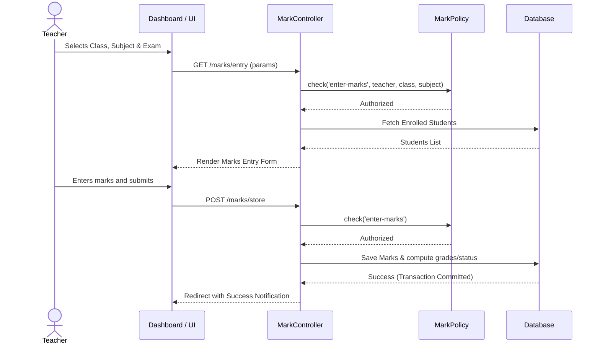

# Smart School Data Gathering & Management System (SMIS)
## System Documentation

This document provides a comprehensive overview of the SMIS application, detailing its architecture, roles, capabilities, and workflows.

---

## 1. System Overview
SMIS is a centralized, role-based, web-based school administration platform built with Laravel. It replaces manual, paper-based record-keeping with a secure, digital solution for managing student data, attendance, timetables, examinations, and reporting. 

### Key Features:
- **Role-Based Access Control (RBAC):** Granular permissions for Admins, Officers, Teachers, and Students.
- **Academic Structure Management:** Manage grades, classes, streams, and subjects.
- **Attendance Tracking:** Student and teacher attendance with monthly summaries.
- **Examination Management:** Handle term tests, scholarship exams, and O/L & A/L results.
- **Timetable Management:** Class and teacher timetables with conflict detection.
- **Reporting & Analytics:** Generate PDF/CSV reports and view dashboard analytics.
- **SMIS Agent:** An integrated AI assistant (Gemini) capable of executing role-scoped actions via natural language.

---

## 2. Roles & Capabilities

The system defines four primary roles, each with specific capabilities enforced via Laravel Policies and Spatie Permissions.

### 2.1 Administrator (`admin`)
The system owner with full access to all modules and configurations.
- **Capabilities:** Manage users (Admins, Officers, Teachers, Students), configure academic structure (grades, streams, classes, subjects), manage all timetables and exams, view all reports, and access system audit logs.

### 2.2 Officer (`officer`)
Administrative staff responsible for data entry and day-to-day operations.
- **Capabilities:** Similar to Admin but lacks access to destructive actions or core system configurations. They handle student enrollments, teacher assignments, data entry for exams, and report generation.

### 2.3 Teacher (`teacher`)
Teachers have scoped access based on their specific assignments (Class Teacher, Subject Teacher, or PT/PD Teacher).
- **Capabilities:**
  - **Class Teacher:** Manage students in their class, take class attendance, enter marks for their class, and view class-level reports.
  - **Subject Teacher:** Take attendance for their subject periods, enter marks for their assigned subjects, and view subject-specific performance.
  - **General:** View own timetable, view own attendance, and access the SMIS Agent for assistance.

### 2.4 Student (`student`)
Read-only access for students to track their academic progress.
- **Capabilities:** View own timetable, track personal attendance, view own examination results, and access personal reports.

---

## 3. Module Overview

| Module | Description |
|---|---|
| **Authentication** | Secure login, session management, and localization (English/Sinhala/Tamil). |
| **Admin/Officer** | Core management for academic structures, user profiles, and system settings. |
| **Teacher** | Dashboards and tools tailored to a teacher's specific assignments. |
| **Student** | Read-only portals for students to view their data. |
| **Attendance** | Session-based attendance tracking for both students and staff. |
| **Timetable** | Period-by-period scheduling, grid visualization, and conflict detection. |
| **Examination** | Exam setup, marks entry, pass/fail calculation, and result publishing. |
| **Reporting** | Data aggregation for at-risk students, rankings, and downloadable PDF/CSV exports. |
| **SMIS Agent** | Context-aware AI assistant leveraging Gemini for automated data retrieval and task execution. |

---

## 4. System Diagrams

### 4.1 Use Case Diagram
Visualizes the primary interactions each role has with the system.

### 4.2 Entity-Relationship (ER) Diagram
Illustrates the core database schema and relationships.

### 4.3 Class Diagram
A high-level view of the primary Laravel Eloquent Models.

### 4.4 Sequence Diagram: Marks Entry Workflow
Demonstrates the secure process of a teacher entering exam marks.

---

## 5. Technology Stack
- **Backend:** Laravel 11.x (PHP 8.2+)
- **Database:** MySQL / SQLite (for local testing)
- **Frontend:** Laravel Blade, Tailwind CSS, Flux UI, Alpine.js
- **Authentication:** Laravel Fortify + Spatie Laravel Permission
- **AI Integration:** Google Gemini API (for SMIS Agent)
- **PDF Generation:** DomPDF

## 6. Security & Auditing
- All routes and actions are strictly protected using **Laravel Policies** to ensure users can only access data relevant to their role and assignments.
- An **ActivityLogger** tracks critical actions (e.g., marks entry, attendance modification, user creation) to maintain a secure audit trail.
